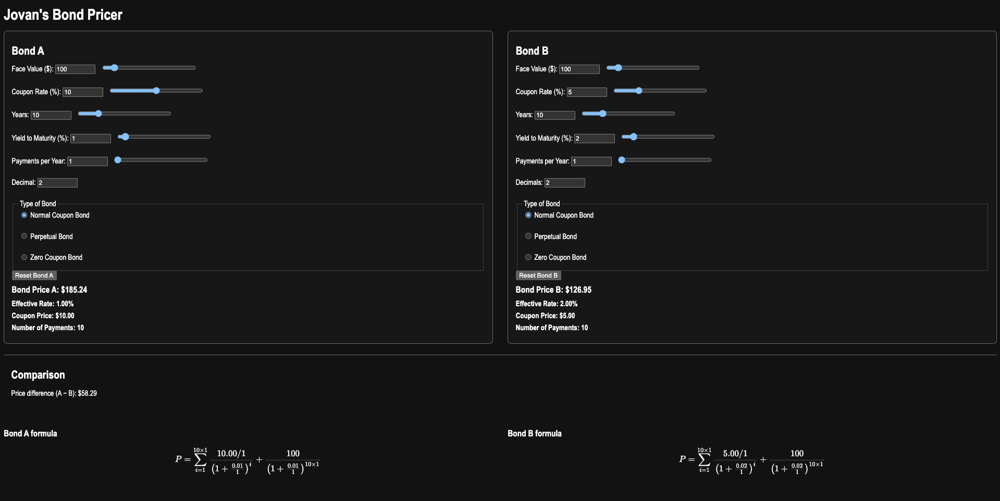
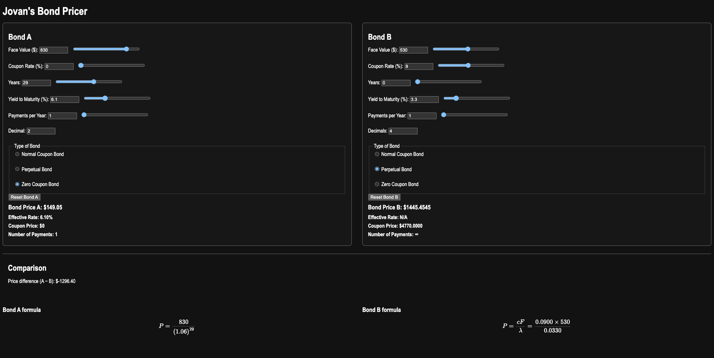

# Jovans Bond Pricer
A web-based bond pricing tool that calculates the price of normal coupon, perpetual and zero‑coupon bonds, with side‑by‑side comparison between two bonds. 
The app is built with HTML, CSS and JavaScript.

Features
	•	Three bond types
	•	Normal coupon bond
	•	Perpetual bond
	•	Zero‑coupon bond
	•	Two‑bond comparison
	•	Independent input panel for Bond A and Bond B
	•	Real‑time updates of prices
	•	Interactive controls
	•	Sliders and numeric inputs for face value, coupon rate, years to maturity, yield and payments per year
	•	Reset buttons for Bond A and Bond B to restore default parameters
	•	Formula visualization using MathJax
	•	Displays the exact pricing formula for each bond, with current input values substituted
	•	Separate formula panels for Bond A and Bond B
	•	Clean UI for finance use cases
	•	Output cards for bond price, effective rate, coupon payment and number of payments
  
How it works
	•	The app prices bonds by discounting future cash flows using the specified yield to maturity and coupon schedule.
	•	For coupon bonds, price is computed as the sum of discounted coupon payments plus the discounted face value at maturity.
	•	Perpetual bonds are priced as a perpetuity, using the closed‑form  where  is the annual coupon rate and  is the annual yield.
	•	Zero‑coupon bonds are priced as a single discounted cash flow of the face value at maturity.
  
Tech
	•	HTML5 for structure and layout
	•	CSS3 for dark‑theme styling and responsive two‑column layout
	•	Vanilla JavaScript for calculations, event handling and slider/field synchronization
	•	MathJax for rendering LaTeX formulas of the pricing equations
  
Structure
	•	 index.html  – main page with Bond A/B panels, comparison and formula containers
	•	 Style.css  – styling for layout, typography and dark theme
	•	 Calc.js  – pricing logic, event wiring, sliders, and reset functionality
	•	 FormulaBuilder.js  – LaTeX generation and MathJax rendering for bond formulas

